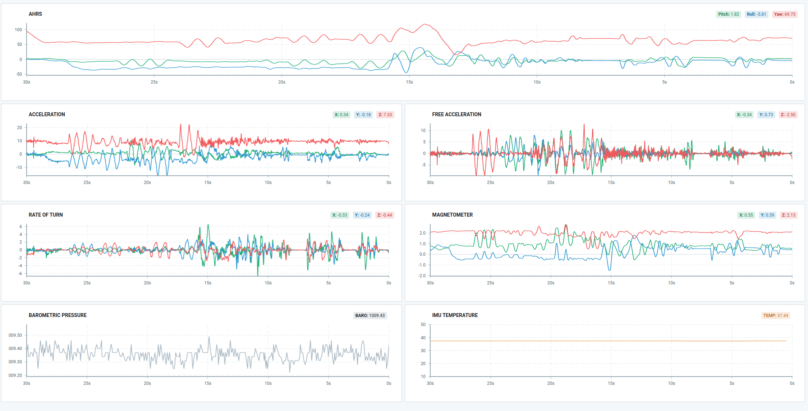

# xsens MTi Serial C Library

This C library is intended for use on microcontrollers (though can be used on typical computers fairly easily) for high performance robotics applications.

The parser is hardware agnostic, with a design philosophy around structured data and callback functions when valid packets are decoded.

> Happy to discuss issues & merge reasonable PRs.

## Why?

With the exception of one Arduino library (which didn't work for me), and examples from xsens which are SPI/I2C & specific to MTi-1/3/7 modules, there wasn't anything available (other than ARM SBC options) which would let me interface an external AHRS unit to my embedded platform.

At time of writing, I couldn't find any suitable C libraries/examples for communicating over UART/RS232.

The packet layout and packet-in-packet (MData2) format variations mean writing a general handler and decoder is a bit terse, and the xsens C++ example shifts this responsibility to the developer.

This library _aims_ to provide a more sane approach, with application code not requiring any buffer handling or IMU specific logic.

## Does it work?

[Yes, example firmware and GUI here](https://github.com/Scottapotamas/xsens-stm32-eui).



MTManager was used with various output configurations to capture real packets alongside decoded reference outputs (see `/docs/mtmanager_packets.md`). These packets back the test-driven development approach of the library, while the [MT Low Level Documentation PDF](https://www.xsens.com/hubfs/Downloads/Manuals/MT_Low-Level_Documentation.pdf) was used as reference material.

I've tested the library against a MTi-300 connected to a STM32F4 discovery board via RS232 transceiver.

I use this library in production with several MTi-300 units connected to a custom STM32F429 controller, also through a RS232 transceiver.

## What's the catch?

Most of the xsens IMU hardware is pretty expensive. So it's unlikely many people will read this...

- No specific effort has been put into ensuring portability of this library to big-endian processors.
- Without other IMU hardware, I'm unable to provide functional/correctness guarantees.
  - Unit tests don't cover MTi-7/600/700 specific configuration or functionality (i.e. GNSS info).

- While the library tries to follow message identifiers and fields outlined by xsens, some sections aren't implemented (but an escape hatch is provided).

# Usage

A minimal Arduino compatible implementation is described in `/example/basics` and is quickly explained in the following sections.

> Examples aren't exhaustive across all messages/payloads, though enums describing possible inbound/outbound message identifiers, and the list of callback event flags [is described in the `xsens_constants` header](src/xsens_constants.h).

## Basic Setup

- Include `xsens-mti.h` in your application code.

- Create a callback function which will receive motion data after the library has parsed and decoded packets:

  ```c
  void imu_event_cb( XsensEventFlag_t event, XsensEventData_t *mtdata );
  ```

- Optionally create another callback to allow the library to write binary data to the IMU:

  ```c
  void imu_write_cb( uint8_t *buffer, uint16_t len );
  ```

- Declare a `xsens_interface_t`, and pass it pointers to the callback functions:

  - At compile time:
    ```c
    xsens_interface_t imu_interface = XSENS_INTERFACE_RX( &imu_event_cb );
    xsens_interface_t imu_interface = XSENS_INTERFACE_RX_TX( &imu_event_cb, &imu_write_cb );
    ```
    ```c
    // Longform setup
    xsens_interface_t imu_interface = { .event_cb = &imu_event_cb, .output_cb = &imu_write_cb };
    ```
    
  - At run-time:

    ```c
    xsens_interface_t imu_interface;
    imu_interface.event_cb = &imu_event_cb;
    imu_interface.output_cb = &imu_write_cb;
    ```

- Pass inbound serial data to the library as it arrives. The parser uses a state-machine design and is happy accepting a single byte, or many, with no timing requirements.

  - Individual bytes:

    ```c
    xsens_mti_parse( &imu_interface, byte );
    ```

  - Buffer of data:

    ```c
    xsens_mti_parse_buffer( &imu_interface, &rx_buff, rx_len );
    ```

That's it. The `/examples` folder has Arduino compatible implementations for reference.  

### Low RAM targets

The xsens packet specification allows for 'extended length' payloads, up to `2048B`.

Current implementation in this library allows for these with a sufficiently large buffer. This means the default library implementation will exhaust RAM on particularly constrained targets like Atmel 328p (Arduino Uno).

If you find yourself in this unique situation,

1. Open `/src/xsens_constants.h` in your editor
2. Manually reduce the buffer length in `xsens_packet_buffer_t` to something larger than `255`, i.e. `uint8_t  payload[256];`
3. Try building and hope it fits on your micro.
4. Reconfigure your IMU with MTManager to disable GNSS `PVT` and/or `SatInfo` packets, as these are most likely to need large packets.
4. Re-think your system design, as your IMU is massively overkill for your requirements or your micro is inadequate for your task! 

## Using motion data

In the application code event callback `imu_event_cb()` or similar, catch relevant events generated by the library when one of the `MData2` packets is received.

- `XsensEventFlag_t` signifies what kind of data has been processed.
- `XsensEventData_t` is a structure containing:
  - a type flag (enum) describing what data format is used in the
  - union of possible payload types ranging from `uint16_t` to a `float[9]` 

This method allows the application code to receive ready-to-use values immediately after they are decoded.

> Note that `*mtdata` points to data on the stack and is not long-lived.

```c
void imu_event_cb( XsensEventFlag_t event, XsensEventData_t *mtdata )
{
    switch( event )
    {
        case XSENS_EVT_PACKET_COUNT:
            // ...
        break;

        case XSENS_EVT_ACCELERATION:
            if( mtdata->type == XSENS_EVT_TYPE_FLOAT3 )
            {
                // Update the PID controller with x, y, z accelerometer 
                // These are 4-byte floats
                controller_update( mtdata->data.f4x3[0], 
                                   mtdata->data.f4x3[1], 
                                   mtdata->data.f4x3[2] );
            }
        break;
            
        case XSENS_EVT_PRESSURE:
        	// ...
        break;
	}
}
```


### XsensEventFlag list

List of possible user-facing events is listed below. I'd recommend just looking at the `mdata2_decode_rules`  table [in `xsens_mdata2.c`](src/xsens_mdata2.c) as it also lists the corresponding event type.

```
XSENS_EVT_TEMPERATURE
XSENS_EVT_UTC_TIME
XSENS_EVT_PACKET_COUNT
XSENS_EVT_TIME_FINE
XSENS_EVT_TIME_COARSE
XSENS_EVT_QUATERNION
XSENS_EVT_EULER
XSENS_EVT_ROT_MATRIX
XSENS_EVT_PRESSURE
XSENS_EVT_DELTA_V
XSENS_EVT_DELTA_Q
XSENS_EVT_ACCELERATION
XSENS_EVT_FREE_ACCELERATION
XSENS_EVT_ACCELERATION_HR
XSENS_EVT_RATE_OF_TURN
XSENS_EVT_RATE_OF_TURN_HR
XSENS_EVT_GNSS_PVT_PULSE
XSENS_EVT_RAW_ACC_GYRO_MAG_TEMP
XSENS_EVT_RAW_GYRO_TEMP
XSENS_EVT_MAGNETIC
XSENS_EVT_STATUS_BYTE
XSENS_EVT_STATUS_WORD
XSENS_EVT_DEVICE_ID
XSENS_EVT_LOCATION_ID
XSENS_EVT_POSITION_ECEF
XSENS_EVT_LAT_LON
XSENS_EVT_ALTITUDE_ELLIPSOID
XSENS_EVT_VELOCITY_XYZ
```

## Overriding parser functionality

In situations where you want to handle a packet directly, declare your own handler function to process the payload.

This is the previously mentioned 'escape-hatch' you should use if trying to handle unsupported packets.

```c
void imu_icc_command_ack( xsens_packet_buffer_t *packet )
{
    // Use the packet fields to post-process as needed:
    //     packet->message_id
    //     packet->length
    //     packet->payload
}
```

During your setup, provide the callback pointer and `MID` to filter for. Use the enum value in `xsens_constants.h` or the raw value:

```c
bool ok = xsens_mti_override_id_handler( 0x75, &imu_icc_command_ack );
bool ok = xsens_mti_override_id_handler( MT_ICCCOMMANDACK, &imu_icc_command_ack );
```

When the parser has a valid packet (passed CRC check), the callback is fired.

> Note that the `packet_buffer_t` structure being pointed to is contained in the user-space `xsens_interface_t` state variable (typically heap allocated).
>
> This data will persist after the callback, but **will be wiped** when another packet is received.

This payload data is directly from the IMU (unprocessed), and you'll likely need to convert fields from their big-endian format to little-endian. `xsens_utility.h` has some helper functions to assist:

```c
uint16_t xsens_coalesce_16BE_16LE( uint8_t *source );
uint32_t xsens_coalesce_32BE_32LE( uint8_t *source );
float    xsens_coalesce_32BE_F32LE( uint8_t *source );
```

The possible message identifiers (and the id's with integrated handling) are paired in the [partially populated 'jump table'](src/xsens_mti.c).

## Sending packets to the IMU

For simple queries against the hardware, use the request function with the message ID. When the device responds, the library (or user-overridden callback) will receive a callback.

```c
xsens_mti_request( &imu_interface, MT_REQFWREV );
```

Some helper functions are provided for simple commands, but may require putting the IMU into configuration mode first. Refer to `/examples/write_config` for a reference implementation of changing mode and configuring output data/rates.


```c
xsens_mti_set_baudrate( &imu_interface, XSENS_BAUD_460800 );
xsens_mti_reset_orientation( &imu_interface, XSENS_ORIENTATION_ALIGNMENT_RESET );
```

More complex configuration functions expect the end-user to provide valid settings: 

```c
XsensFrequencyConfig_t settings[] = {
    { .id = XDI_PACKET_COUNTER, .frequency = 0xFFFF },  // 0xFFFF -> included in every output packet 
    { .id = XDI_STATUS_WORD,    .frequency = 0xFFFF },     
    { .id = XDI_QUATERNION,     .frequency = 100    },  // Hz
    { .id = XSENS_IDENTIFIER_FORMAT(XDI_LAT_LON, XSENS_FLOAT_FIXED1632, XSENS_COORD_ENU), .frequency = 4 },
    { .id = XSENS_IDENTIFIER_FORMAT(XDI_VELOCITY_XYZ, XSENS_FLOAT_SINGLE, XSENS_COORD_NED), .frequency = 100 },
};

xsens_mti_set_configuration( &imu_interface, settings, XSENS_ARR_ELEM(settings) );

```


Beyond this, create a `xsens_packet_buffer_t` object manually and send it to hardware:

```c
packet.message_id = MT_SETBAUDRATE;
packet.length = 1;
packet.payload[0] = 0x80;

xsens_mti_send( interface, &packet );
```


# Running tests

[](https://github.com/Scottapotamas/xsens-mti/actions/workflows/ceedling.yml)

Testing uses the [Ceedling](http://www.throwtheswitch.org/ceedling/) (Ruby/rake) based testing framework with `Unity` and `CMock`.

1. *If* you don't have Ceedling installed:

   - Either install it with your OS's package manager,
   - Manual install `ceedling` with `gem install --user ceedling`.

2. Once setup, run `ceedling` or `ceedling test:all`.

GitHub Actions compile the Arduino examples and run unit-tests when pull-requests are made.

## Coverage Analysis

- Run `ceedling gcov:all` to generate the coverage reports.
- Use `ceedling utils:gcov` to generate a pretty HTML report.
  - HTML output is located in the `/build/artifacts/gcov` folder.

You need `gcovr` installed, and on some Linux distros, may also need a `gcovr` run-time dependency `jinja2`.

# References & Acknowledgement

- xsens have documented their protocol and the behaviour in the [MT Low Level Documentation PDF](https://www.xsens.com/hubfs/Downloads/Manuals/MT_Low-Level_Documentation.pdf).
- xsens MTManager software provides a packet viewer was used to capture and decode several 'golden' packets used in unit tests.

This library is [Apache2 licenced](LICENSE).
